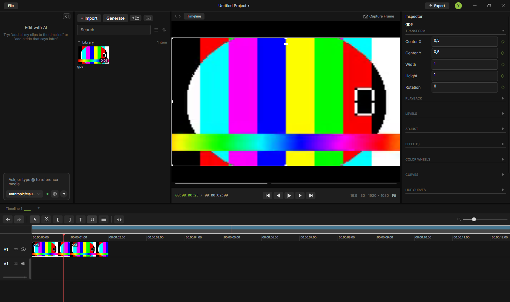

<div align="center">


# PalmierWin

</div>

**A Windows-native AI video editor — built on the open source [Palmier Pro](https://github.com/palmier-io/palmier-pro) codebase.**



PalmierWin takes Palmier Pro's portable editor core and rebuilds everything Apple-specific on Windows foundations: a C#/Avalonia shell, a Vulkan compositor, FFmpeg decode/encode, and a Swift media engine shared with the original project through `PalmierCore`.

This is an independent fork by [@yassinebkr](https://github.com/yassinebkr), not an official Palmier product. The upstream macOS app (SwiftUI/AppKit, macOS 26) still lives in `Sources/` and builds unchanged.

## Install (Windows)

**[Download the latest installer](https://github.com/yassinebkr/palmierWin/releases/latest/download/PalmierWin-Setup.exe)** and run it — no admin needed. Requirements: Windows 10/11 x64 and a Vulkan-capable GPU (the installer and the app both check and say so clearly instead of crashing). Updates install themselves silently the moment a new release is published.

First launch asks your name and accent color. If something goes wrong, logs are always on: `%APPDATA%\PalmierPro\logs\` — use the badge menu's *Report a problem* to share them.

## Status

The Windows app is real and running. What works today:

- **Editor shell (Avalonia):** AppTheme-faithful dark UI — media library (folders, search, grid/list, hover scrub), preview with transport + source-monitor tabs, custom timeline (filmstrips, waveforms, roll/trim/blade/ripple edits, snap, loop ranges, multi-track, per-track height/gain/meters, tabs), inspector (transform, keyframes, fades, effects, LUT, color wheels, grade + hue curve editors), undo/redo, project files (`.palmier` save/open/autosave), export queue to H.264/MP4, FCPXML interchange, auto-update.
- **Media engine (Swift + Vulkan + FFmpeg):** frame-accurate decode with seek-and-walk caching, 17 effect kernels re-authored in SPIR-V, text layers, audio (miniaudio/WASAPI), composited-frame capture, offscreen export.
- **AI agent:** multi-provider chat (Anthropic, OpenAI, Z.AI, Moonshot, OpenRouter) with tool-use editing of the timeline, streaming, permission prompts, live model lists — or drive the editor from an external MCP client (below).
- **Generation:** Replicate and fal.ai integration (Seedance 2.0, Kling 3.0, FLUX.3, Veo 3 families) with first/last-frame transitions from timeline cuts, a guided prompt builder, optional location context from footage GPS tags, clip extension (Enhance) from a clip's tail, reference media, cost estimates, and provenance sidecars with a recent-generations list.

Architecture: the shell talks to the Swift core in-proc through a thin `@_cdecl` C ABI (`PalmierCoreHost.dll`) — no COM, no WinUI 3. See [`docs/windows-port-proposal.md`](docs/windows-port-proposal.md) for the port's foundations and the `PalmierWin/` directory for the engine.

## Connect an external agent (MCP)

The editing tools can be driven by an external MCP client instead of the built-in chat agent: pick *Settings → AI → AI agent → External MCP client*, then approve the client in the left panel when it connects. The server listens on `127.0.0.1:19789` (loopback only) and speaks streamable-HTTP JSON-RPC at `/mcp`. Claude Desktop needs the stdio→HTTP shim at `mcpb/server/index.js` — add this to `claude_desktop_config.json`:

```json
{
  "mcpServers": {
    "palmierwin": {
      "command": "node",
      "args": ["C:\\path\\to\\palmier-pro\\mcpb\\server\\index.js"]
    }
  }
}
```

## Building

Requirements: Swift 6.3.3+ (`x86_64-unknown-windows-msvc`), .NET 9 SDK, MSVC Build Tools, an NVIDIA/AMD/Intel GPU with Vulkan.

```powershell
cd PalmierWin
.\fetch-deps.ps1          # Vulkan headers, FFmpeg, glslang, ImGui, miniaudio
.\build.bat               # Swift engine + PalmierCoreHost.dll
dotnet build Shell        # C# shell
.\Shell\run-shell.ps1     # run the editor
```

Tests: `dotnet test PalmierWin/Shell/PalmierShell.sln` (740+ shell and interop tests) and the `palmierwin-spike` engine harness.

## Credits

PalmierWin is built on [Palmier Pro](https://github.com/palmier-io/palmier-pro) by Palmier, Inc. — the editor core, data model, and product design are theirs. Huge thanks for open-sourcing it.

## License

Copyright (C) 2026 Palmier, Inc. (original Palmier Pro code) and the PalmierWin contributors (Windows port).

Open source under [GPLv3](LICENSE).
